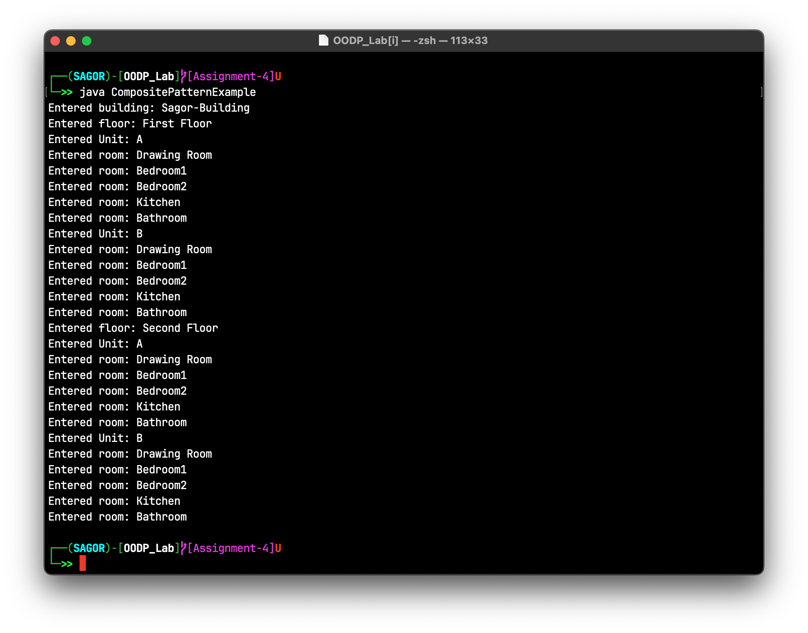

<h1 align="center">Assignment-4</h1>

## Assignment Branches
**Note:** My assignments are structured in branches as follows:

- **Assignment 1:** Branch `Assignment-1`
- **Assignment 2:** Branch `Assignment-2`
- **Assignment n:** Branch `Assignment-n`

## Problem Statement:
Write a Java program that demonstrate the implementation of a composite design pattern by using an example with a building composed of generic housing structures.

## Design Pattern Overview

The **Composite Design Pattern** is a structural pattern that allows you to compose objects into tree structures to represent part-whole hierarchies. It lets clients treat individual objects and compositions of objects uniformly.

In this example, I create a hierarchy of housing structures, including `Room`, `Unit`, `Floor`, and `Building`, where each structure can contain other structures.

## Code Structure

- `HousingStructure` (Interface): Represents the common interface for all housing structures with an `enter()` method.
- `Room` (Class): Represents a room in the building.
- `Unit` (Class): Represents a unit or apartment that can contain multiple housing structures.
- `Floor` (Class): Represents a floor of the building, which can contain units.
- `Building` (Class): Represents the building itself, which can contain floors.
- `CompositePatternExample` (Class): Contains the `main` method to demonstrate the composite design pattern.

## Class Diagram

## Output

