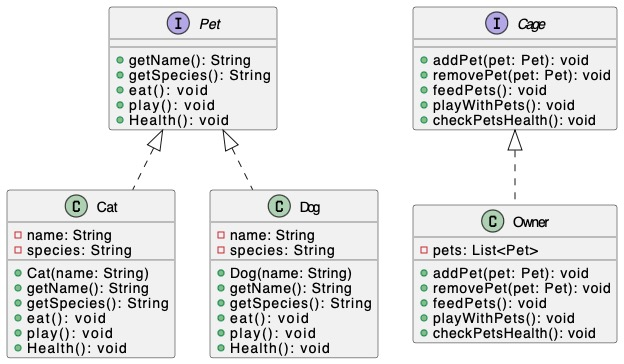

<h1 align="center">Assignment-2</h1>

## Assignment Branches
**Note:** My assignments are structured in branches as follows:

- **Assignment 1:** Branch `Assignment-1`
- **Assignment 2:** Branch `Assignment-2`
- **Assignment n:** Branch `Assignment-n`

## Problem Statement:
Write a Java Program for Pet Management System with appropriate OOP Concept and Design Process.

## Components
The Pet Management System consists of the following Java classes:

- `Pet`: An interface that defines common behaviors for pets, including `getName`, `getSpecies`, `eat`, `play`, and `Health` methods.
- `Cat`: A class that implements the `Pet` interface to represent cats.
- `Dog`: A class that implements the `Pet` interface to represent dogs.
- `Cage`: An interface that defines methods for managing pets, including `addPet`, `removePet`, `feedPets`, `playWithPets`, and `checkPetsHealth`.
- `Owner`: A class that implements the `Cage` interface to manage a collection of pets and perform actions on them.
- `PetManagement`: The main class that contains the `main` method to run the program.

## Class Diagram
