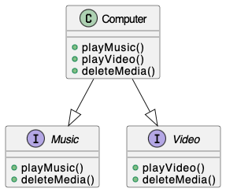

<h1 align="center">Assignment-1</h1>

## Assignment Branches
**Note:** My assignments are structured in branches as follows:

- **Assignment 1:** Branch `Assignment-1`
- **Assignment 2:** Branch `Assignment-2`
- **Assignment n:** Branch `Assignment-n`

## Problem Statement:
 Write a Java Program to Demonstrate Multiple Inheritance.

## Classes
### Music Interface

- `playMusic()`: Defines the method for playing music.
- `deleteMedia()`: Defines the method for deleting media.

### Video Interface

- `playVideo()`: Defines the method for playing videos.
- `deleteMedia()`: Defines the method for deleting media.

### Computer Class

- Implements both the `Music` and `Video` interfaces.
- Provides concrete implementations for all the methods defined in these interfaces.
- Allows playing music, playing videos, and deleting media.

## Class Diagram

