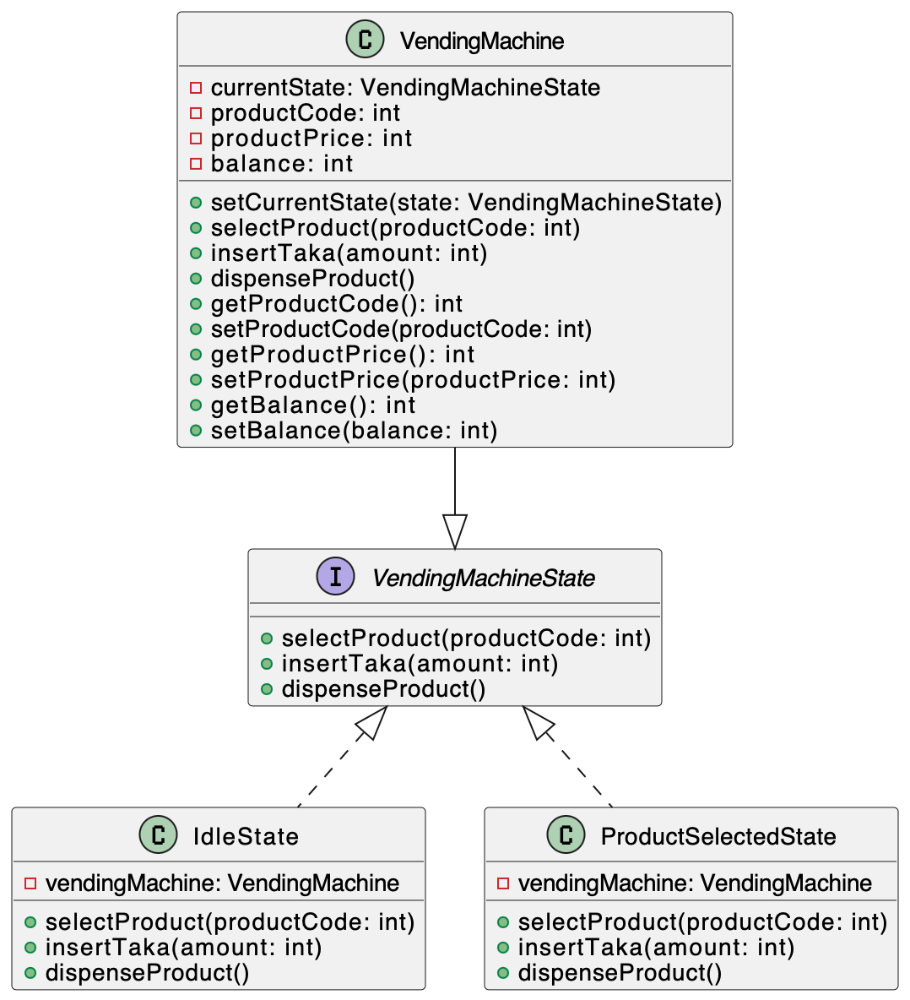

<h1 align="center">Object Oriented and Design Pattern Lab</h1>

## Assignment Branches
**Note:** My assignments are structured in branches as follows:
- **Assignment 1:** Branch `Assignment-1`
- **Assignment 2:** Branch `Assignment-2`
- **Assignment n:** Branch `Assignment-n`

## Problem Statement
Write a Java program to demonstrate the implementation of a state design pattern for a vending machine functionality on purchasing items.

## Overview

The State Design Pattern is a behavioral design pattern that allows an object to alter its behavior when its internal state changes. It is particularly useful when an object can have multiple states, and each state requires different behavior.

In this example, I demonstrate the State Design Pattern by implementing a simple Vending Machine. The Vending Machine can be in different states, such as `Idel` and `ProductSelected`. The behavior of the machine varies based on its current state.

## Implementation

### Vending Machine

- `VendingMachine` is the context class that holds the current state and controls the behavior of the vending machine.
- It has methods to select a product, insert taka, and dispense a product.
- The class delegates the operations to its current state, and the state-specific behavior is implemented in concrete state classes.

### Vending Machine States

- `VendingMachineState` is an interface that defines the methods for different state behaviors.
- `IdleState` and `ProductSelectedState` are concrete state classes that implement the behavior for the vending machine in different states.
- The states handle product selection, taka insertion, and product dispensing based on their specific logic.

## Example

Here's a simple example of using the Vending Machine with the State Design Pattern:

```java
VendingMachine vendingMachine = new VendingMachine();
vendingMachine.selectProduct(1);   // Select a product
vendingMachine.insertTaka(10);     // Insert coins
vendingMachine.dispenseProduct();  // Dispense the product
```
## Class Diagram
