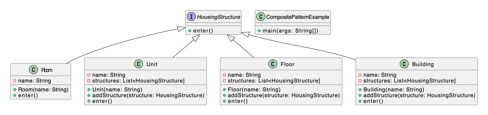

<h1 align="center">Assignment-3</h1>

## Assignment Branches
**Note:** My assignments are structured in branches as follows:

- **Assignment 1:** Branch `Assignment-1`
- **Assignment 2:** Branch `Assignment-2`
- **Assignment n:** Branch `Assignment-n`

## Problem Statement:
Write a Java program to demonstrate the implementation of a façade design pattern for a Banking Service with Checking, Saving, and Investment modules.

## Components

The banking system consists of the following major components:

- **Account Interface**: An interface that defines common banking operations such as deposit, withdraw, transfer, and getAccountNumber.

- **ChequingAccount**: A class implementing the Account interface for chequing accounts.

- **SavingAccount**: A class implementing the Account interface for saving accounts.

- **InvestmentAccount**: A class implementing the Account interface for investment accounts.

- **BankService**: A service class that manages accounts using a Hashtable. It provides methods to create new accounts, deposit money, withdraw money, and transfer money between accounts.

- **Customer**: A class that demonstrates the usage of the banking system by creating accounts and performing transactions.

## Usage

To use the banking system:

1. Create instances of different types of accounts using the `BankService` class.

2. Deposit money into accounts using the `depositMoney` method.

3. Withdraw money from accounts using the `withdrawMoney` method.

4. Transfer money between accounts using the `transferMoney` method.

## Class Diagram

Below is a simplified class diagram of the banking service:

